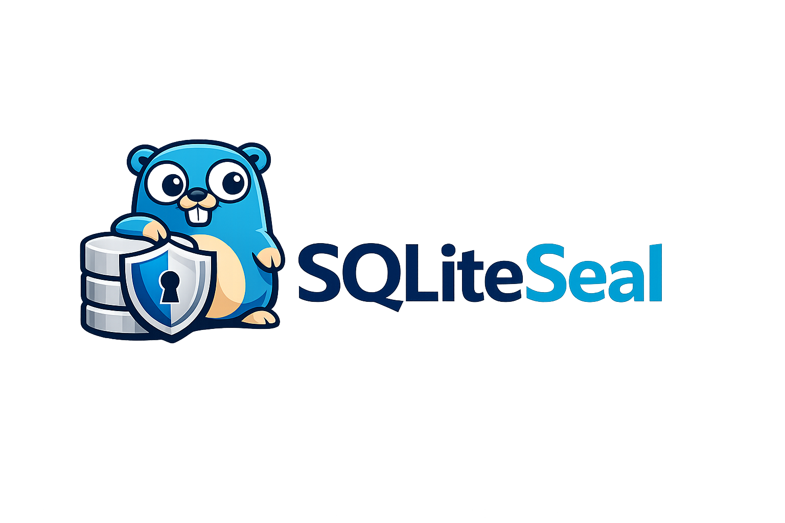

<p align="center">
  
</p>

# SQLiteSeal

`SQLiteSeal` is a Go driver for encrypted, zero-trust SQLite databases featuring built-in **masterless active-active replication**. Built on top of `github.com/mattn/go-sqlite3`, it adds transparent page-level encryption to SQLite database files, stores envelope-protected key material in a `*.encz` sidecar manifest, and enables decentralized, peer-to-peer multi-master synchronization across nodes without requiring a centralized primary or consensus server.

> [!IMPORTANT]
> SQLiteSeal's core use as an encrypted replacement for SQLite is stable and
> suitable for production use when deployed according to the documented
> operational and key-management requirements. The replication functions in
> the Go package are still under active development and must not be used in
> production yet.

## Documentation

Detailed documentation guides are available in the [`documentation/`](documentation) directory:

- [**Architecture & Design (`documentation/ARCHITECTURE.md`)**](documentation/ARCHITECTURE.md): System topology, custom SQLite `encz` VFS, CGO bridge, 48-byte trailer layout, AAD parameter binding, and LRU decrypted-page cache design.
- [**Replication API (`documentation/REPLICATION_API.md`)**](documentation/REPLICATION_API.md): Node and peer setup, authenticated membership activation, lifecycle controls, schema restrictions, and the two-node verifier.
- [**API Reference (`documentation/API_REFERENCE.md`)**](documentation/API_REFERENCE.md): Exhaustive API catalog of exported types (`DB`, `Options`, `Cipher`), methods, backup/restore functions, database conversion tools, and error sentinels.
- [**Cryptographic Specification (`documentation/CRYPTO_SPEC.md`)**](documentation/CRYPTO_SPEC.md): Technical specification for security auditors covering key hierarchy (Master Key -> KEK -> DEKs), Argon2id KDF parameters, `memguard` memory protection, cipher suites, CSPRNG nonces, and threat model boundaries.
- [**Operations & Migration Guide (`documentation/OPERATIONS_GUIDE.md`)**](documentation/OPERATIONS_GUIDE.md): Operational guide covering database conversion (`ConvertDB`), live key rotation (`ReKey`), backup and staging restore workflows, performance tuning, cache metrics, and troubleshooting.

## Benchmark: SQLiteSeal vs. Turso AES-256-GCM

The standalone benchmark runs the same schema, seed data, writes, reads, aggregations, joins, reopen validation, and on-disk plaintext check against SQLiteSeal (AES-256-GCM) and the Turso embedded Go driver (AES-256-GCM). It retains plain SQLite as a baseline.

```bash
cd tests-benchmark
go run .
```

Use `-turso` to choose Turso's local database path, `-turso-hex-key` to provide its required 32-byte hex key, and `-sqliteseal-read-cache-bytes` to change SQLiteSeal's decrypted-page cache budget (`-1` disables it). The report includes SQLiteSeal cache, physical-read, AEAD, allocation, and copy metrics.

```bash
go run . -rows 10000 -write-rows 20000 -turso /tmp/turso-aes256gcm.db
```

## Continuous oracle test

[`app-test`](app-test) is a standalone long-running verification application
with 20 related tables and an independent in-memory oracle. It continuously
checks inserts, updates, point and list reads, full-row joins, integrity,
reopen, encrypted backup/restore, rekey, all supported ciphers, and the public
SQLiteSeal API. It runs until Ctrl-C by default and preserves each run's log and
database artifacts for diagnosis.

```bash
cd app-test
go run .
```

## Architecture

`SQLiteSeal` registers a custom SQLite VFS named `encz` (retained for on-disk and connection compatibility). For file-backed databases, the master key unlocks a `db.encz` manifest that contains the full DEK set for the database. SQLite then opens the database through that VFS and page I/O is transformed in place on the flat database file.

- **Storage format**: Standard SQLite database and WAL files on disk, an encrypted `db.encz` sidecar manifest, and a `db.encz.lock` coordination file.
- **Reserved bytes**: `SQLiteSeal` reserves 48 bytes on each SQLite page.
- **Encryption**: New databases default to **AES-256-GCM** and may instead use **ChaCha20-Poly1305** or **XChaCha20-Poly1305**. The selected cipher protects pages, manifests, and backup archives.
- **Per-page metadata**: The final 48 reserved bytes hold 4 bytes of flags, a 4-byte DEK key ID, a 24-byte nonce slot, and a 16-byte authentication tag. AES-GCM and ChaCha20-Poly1305 use the first 12 nonce bytes; XChaCha20-Poly1305 uses all 24.
- **Nonce generation**: Each encrypted container uses a fresh operating-system random nonce. AES-GCM and ChaCha20-Poly1305 use 96-bit nonces; XChaCha20-Poly1305 uses 192-bit nonces. For pages, this provides probabilistic nonce uniqueness per DEK rather than a deterministic counter-based guarantee.
- **Authentication binding**: The AEAD authentication tag is computed with additional authenticated data (AAD) that binds the ciphertext to the database UUID, page number, file offset, WAL/main-file context, and cipher identifier. This protects page identity and location, but it is separate from nonce uniqueness.
- **Multi-DEK model**: Every page stores the DEK key ID used to encrypt it. Older DEKs remain in the manifest forever, so a single database can contain pages encrypted under different DEKs.
- **Decrypted-page cache**: Each `DB` has a shared, authenticated LRU with a 128 MB default page-payload budget. Entries are validated against the encrypted on-disk trailer before use and wiped on eviction or invalidation.
- **Encrypted-only API**: `SQLiteSeal` only supports file-backed encrypted databases. Plain SQLite files, in-memory databases, direct-key DSNs, and direct-key PRAGMAs are rejected.

```
 SQLite Engine (SQL parsing, query planning, B-trees)
                      |
                      v
         Custom SQLite VFS Extension (encz)
                      |
                      v
              Selected Go AEAD encryption
                      |
                      v
           Flat SQLite database / WAL files
```

## Requirements

- Go 1.25+
- CGO enabled
- Zero external C crypto library dependencies; AEAD operations are provided by Go through CGO callbacks

## Install

```bash
go get github.com/marcgauthier/SQLiteSeal
```

## Usage

### Single-Node (Standalone Encrypted Database)

If you only need standalone encrypted database functionality without replication, simply open the database with `OpenSQLiteSeal` or `OpenWithOptions` without setting any replication options:

```go
package main

import (
	"log"

	"github.com/marcgauthier/SQLiteSeal"
)

func main() {
	db, err := sqliteseal.OpenSQLiteSeal("users.db", "Password123Password123Password123")
	if err != nil {
		log.Fatal(err)
	}
	defer db.Close()

	// Cipher choice is made when creating a database and is then stored in its manifest.
	// db, err := sqliteseal.OpenWithOptions("users.db", sqliteseal.Options{
	// 	Key:                        "Password123Password123Password123",
	// 	Cipher:                     sqliteseal.CipherXChaCha20Poly1305,
	// 	DecryptedPageCacheBytes:    256 << 20,
	// 	EnableReadPerformanceStats: true,
	// })

	db.SetMaxOpenConns(5)

	if _, err := db.Exec(`CREATE TABLE IF NOT EXISTS users (id INTEGER PRIMARY KEY, name TEXT)`); err != nil {
		log.Fatal(err)
	}

	if err := db.SetRotationPolicy(sqliteseal.RotationPolicy{
		KEKRotationDays:  30,
		DEKRotationHours: 24,
		AutoRewrap:       true,
		KeepPreviousKey:  true,
	}); err != nil {
		log.Fatal(err)
	}

	if err := db.ReKey("Password123Password123Password123", "NewPassword123NewPassword123"); err != nil {
		log.Fatal(err)
	}

	if err := db.Backup("users-backup.zip", sqliteseal.BackupOptions{Compression: sqliteseal.BackupCompressionDeflate}); err != nil {
		log.Fatal(err)
	}
}
```

### Two-Node Masterless Active-Active Replication

`SQLiteSeal` includes built-in peer-to-peer active-active replication. The example below sets up two encrypted database nodes (`Node A` and `Node B`) running locally, configures multi-master synchronization on a `users` table, and demonstrates bidirectional replication.

The current Go test suite passes. The accurate claim is: ENCZ can replicate
most conventional SQLite tables with an immutable globally unique key, not
every possible SQLite table.

```go
package main

import (
	"context"
	"crypto/tls"
	"fmt"
	"log"
	"os"
	"path/filepath"
	"time"

	"github.com/google/uuid"
	"github.com/marcgauthier/SQLiteSeal"
)

// StaticCredentialProvider delivers local process-only PSK secrets & TLS configuration.
type StaticCredentialProvider struct {
	PSK []byte
}

func (p *StaticCredentialProvider) GetReplicationPSK(name string) ([]byte, error) {
	return p.PSK, nil
}

func (p *StaticCredentialProvider) GetClientTLSConfig(name string) (*tls.Config, error) {
	return &tls.Config{InsecureSkipVerify: true}, nil
}

func (p *StaticCredentialProvider) GetServerTLSConfig(name string) (*tls.Config, error) {
	return nil, nil
}

func main() {
	ctx := context.Background()
	dir, err := os.MkdirTemp("", "sqliteseal-repl-demo-*")
	if err != nil {
		log.Fatal(err)
	}
	defer os.RemoveAll(dir)

	nodeIDA := uuid.New()
	nodeIDB := uuid.New()
	psk := []byte("0123456789abcdef0123456789abcdef")
	creds := &StaticCredentialProvider{PSK: psk}

	// 1. Open Node A
	dbA, err := sqliteseal.OpenWithOptions(filepath.Join(dir, "nodeA.db"), sqliteseal.Options{
		Key: "MasterKeyNodeA_32BytesLengthPass!",
		Replication: &sqliteseal.ReplicationRuntimeOptions{
			Credentials: creds,
		},
	})
	if err != nil {
		log.Fatal(err)
	}
	defer dbA.Close()

	// 2. Open Node B
	dbB, err := sqliteseal.OpenWithOptions(filepath.Join(dir, "nodeB.db"), sqliteseal.Options{
		Key: "MasterKeyNodeB_32BytesLengthPass!",
		Replication: &sqliteseal.ReplicationRuntimeOptions{
			Credentials: creds,
		},
	})
	if err != nil {
		log.Fatal(err)
	}
	defer dbB.Close()

	// Node A defines the table. Node B selects it for replication without
	// creating it locally; schema negotiation creates it after the nodes connect.
	schema := `CREATE TABLE users (id INTEGER PRIMARY KEY, name TEXT, email TEXT UNIQUE);`
	if _, err := dbA.Exec(schema); err != nil {
		log.Fatal(err)
	}

	// 3. Initialize replication on Node A (Listen on 127.0.0.1:9444)
	err = dbA.InitializeReplication(ctx, sqliteseal.LocalNodeConfig{
		NodeUUID:          nodeIDA,
		NodeName:          "node-a",
		Level:             0,
		ReplicationDomain: "demo-domain",
		ListenAddress:     "127.0.0.1:9444",
		AuthMode:          sqliteseal.ReplicationAuthPSK,
		CredentialName:    "demo-psk",
	}, []sqliteseal.ReplicatedTable{{Name: "users", ConstraintPolicy: sqliteseal.ReplicationConstraintsManaged}})
	if err != nil {
		log.Fatal(err)
	}

	// 4. Initialize replication on Node B (Listen on 127.0.0.1:9445)
	err = dbB.InitializeReplication(ctx, sqliteseal.LocalNodeConfig{
		NodeUUID:          nodeIDB,
		NodeName:          "node-b",
		Level:             1,
		ReplicationDomain: "demo-domain",
		ListenAddress:     "127.0.0.1:9445",
		AuthMode:          sqliteseal.ReplicationAuthPSK,
		CredentialName:    "demo-psk",
	}, []sqliteseal.ReplicatedTable{{Name: "users", ConstraintPolicy: sqliteseal.ReplicationConstraintsManaged}})
	if err != nil {
		log.Fatal(err)
	}

	// 5. Register peers across nodes
	err = dbA.UpsertReplicationPeer(ctx, sqliteseal.ReplicationPeerConfig{
		PeerNodeUUID:    nodeIDB,
		PeerName:        "node-b",
		EndpointAddress: "127.0.0.1:9445",
		Role:            sqliteseal.ReplicationRoleFullDuplex,
		CredentialName:  "demo-psk",
		Enabled:         true,
	})
	if err != nil {
		log.Fatal(err)
	}

	err = dbB.UpsertReplicationPeer(ctx, sqliteseal.ReplicationPeerConfig{
		PeerNodeUUID:    nodeIDA,
		PeerName:        "node-a",
		EndpointAddress: "127.0.0.1:9444",
		Role:            sqliteseal.ReplicationRoleFullDuplex,
		CredentialName:  "demo-psk",
		Enabled:         true,
	})
	if err != nil {
		log.Fatal(err)
	}

	// 6. Write on Node A -> Automatically replicated to Node B
	if _, err := dbA.Exec(`INSERT INTO users (id, name, email) VALUES (1, 'Alice', 'alice@example.com')`); err != nil {
		log.Fatal(err)
	}

	// Wait briefly for peer synchronization
	time.Sleep(300 * time.Millisecond)

	var name string
	err = dbB.QueryRow(`SELECT name FROM users WHERE id = 1`).Scan(&name)
	if err != nil {
		log.Fatal("Replication failed:", err)
	}

	fmt.Printf("Successfully replicated row to Node B! User name: %s\n", name)
}
```

## API Notes

- `sqliteseal.OpenSQLiteSeal` opens an existing encrypted database when `<db>.encz` is present and creates both files when neither the database nor manifest exists.
- `sqliteseal.OpenWithOptions` returns `*sqliteseal.DB`, which wraps `*sql.DB` and adds manifest operations such as `ReKey`, `SetRotationPolicy`, `RotationStatus`, and `Backup`.
- Opening fails with `sqliteseal.ErrManifestMissing` when a database file exists without its manifest.
- Opening fails with `sqliteseal.ErrManifestAuthFailed` when the manifest exists but the master key is wrong.
- In-memory paths, direct-key URI settings, and direct-key PRAGMAs are rejected.
- WAL is the default journal mode. MEMORY is also supported; on-disk rollback journals are rejected because they expose plaintext page images.
- `Options.DecryptedPageCacheBytes` uses 128 MB when zero, accepts a positive byte budget, and uses `sqliteseal.DisableDecryptedPageCache` (`-1`) to disable caching.
- Cached pages are authenticated before insertion and revalidated against their encrypted trailer before a hit is returned. Plaintext is wiped on eviction, invalidation, registry update, and close, but remains resident in ordinary process heap memory while cached.
- `ReadPerformanceStats` and `ResetReadPerformanceStats` expose opt-in read-path measurements when `Options.EnableReadPerformanceStats` is true.

## Backup & Restore

`SQLiteSeal` provides a robust, encrypted backup and restore mechanism designed to securely package the database and its envelope keys.

### Backing Up

The `Backup` method creates a single, encrypted `.zip` archive containing the `.bak` database file and its matching `.bak.encz` manifest.

```go
err := db.Backup("backup.zip", sqliteseal.BackupOptions{
	Compression: sqliteseal.BackupCompressionDeflate,
})
```

- **Encryption**: The archive is sealed with the database's selected cipher. A secondary key is derived from the active master key using a unique salt, separate from the primary database's KEK.
- **Payload**: Contains the database page-encrypted files and the manifest containing all historical DEKs.

### Testing Backups

Before performing a restore, you can verify the integrity of an archive using `TestBackup`.

```go
err := sqliteseal.TestBackup("backup.zip", "MasterKey123", "/tmp/restore-test")
```

This decrypts and unpacks the backup archive to a temporary directory, opens the database using the restored manifest, and runs `PRAGMA integrity_check`.

### Restoring Backups

The `RestoreBackup` function safely extracts and restores a database from an encrypted backup archive.

```go
err := sqliteseal.RestoreBackup("backup.zip", "MasterKey123", "/path/to/restore/dir", false)
```

- **Integrity Validation**: Decrypts the archive to a temporary location and executes `PRAGMA integrity_check` before copying files to the destination. If verification fails, the restore is aborted.
- **Overwrite Protection**: The final parameter (`overwriteExistingFile`) acts as a safety guard. If set to `false`, the restore process will fail if a database file or manifest already exists in the target directory, preventing accidental data loss.

## Database Conversion

`ConvertDB` reads a source database and writes a converted copy to a new file.
The source is never modified.

### Plain SQLite → Encrypted

```go
err := sqliteseal.ConvertDB("plain.db", "encrypted.db", sqliteseal.ConvertOptions{
	TargetKey:    "MySecretKey123",
	TargetCipher: sqliteseal.CipherAES256GCM,
})
```

### Switch Cipher (e.g., AES → XChaCha)

```go
err := sqliteseal.ConvertDB("aes.db", "xchacha.db", sqliteseal.ConvertOptions{
	SourceKey:    "MySecretKey123",
	TargetCipher: sqliteseal.CipherXChaCha20Poly1305,
})
```

### Switch Cipher and Key

```go
err := sqliteseal.ConvertDB("old.db", "new.db", sqliteseal.ConvertOptions{
	SourceKey:    "OldKey123",
	TargetKey:    "NewKey456",
	TargetCipher: sqliteseal.CipherChaCha20Poly1305,
})
```

### Decrypt to Plain SQLite

```go
err := sqliteseal.ConvertDB("encrypted.db", "plain.db", sqliteseal.ConvertOptions{
	SourceKey: "MySecretKey123",
})
```

## Public API Reference

Below is a summary of all public package-level functions and methods available in `sqliteseal`.

### Package-Level Functions

- **`Register() error`**  
  Registers the SQLiteSeal driver and its compatibility `encz` VFS with Go's `database/sql` package automatically.
- **`BuildDSN(path string, opts Options) (string, error)`**
  Constructs a non-secret SQLite DSN. Key-bearing options return `ErrDirectKeyUnsupported`.
- **`BuildSQLiteSealDSN(path, key string) (string, error)`**
  Compatibility stub that always returns `ErrDirectKeyUnsupported`; use `OpenSQLiteSeal`.
- **`OpenSQLiteSeal(path, key string) (*DB, error)`**
  Opens or creates an encrypted database with default configurations and the specified master key.
- **`OpenWithOptions(path string, opts Options) (*DB, error)`**  
  Opens or creates an encrypted database using a customized `Options` configuration.
- **`ConvertDB(srcPath, dstPath string, opts ConvertOptions) error`**
  Reads a database at `srcPath` and writes a converted copy to `dstPath`. Supports
  plain-to-encrypted, encrypted cipher switch, key change, and decrypt-to-plain.
  The source is never modified; the output must not already exist.
- **`TestBackup(file, masterKey, tempFolder string) error`**  
  Decrypts a backup archive and runs a full database integrity check to verify backup correctness.
- **`RestoreBackup(file, masterKey, toFolder string, overwriteExistingFile bool) error`**  
  Decrypts and restores the database and its manifest to a target folder, with overwrite protection.

### Database Handle Methods (`*DB`)

- **`SQLDB() *sql.DB`**  
  Returns the underlying database connection pool used for executing standard SQL queries.
- **`Close() error`**  
  Closes the database connections and securely purges/wipes all cryptographic keys from memory.
- **`ReKey(oldKey, newKey string) error`**  
  Changes the database master key by re-encrypting the manifest envelope with a new derived KEK.
- **`SetRotationPolicy(policy RotationPolicy) error`**  
  Updates and persists the key rotation settings inside the database's sidecar manifest.
- **`RotationStatus() (RotationInfo, error)`**  
  Returns the active rotation policy, DEK count, and when KEK/DEK rotations are next scheduled.
- **`Backup(toFile string, opts BackupOptions) error`**  
  Generates an encrypted ZIP backup of the active database and manifest.
- **`ReadPerformanceStats() ReadPerformanceStats`**
  Returns a point-in-time read-path metrics snapshot. Metrics are collected only
  when `Options.EnableReadPerformanceStats` is enabled.
- **`ResetReadPerformanceStats()`**
  Resets the read-path counters and timers without clearing the page cache.


## Key Rotation

`SQLiteSeal` utilizes envelope encryption to secure file-backed databases:

1. **Master Key**: The user-provided passphrase.
2. **Key Encryption Key (KEK)**: Derived from the master key using Argon2id, used to encrypt/decrypt the sidecar `db.encz` manifest.
3. **Data Encryption Keys (DEKs)**: Cryptographically secure 256-bit keys generated by the library, stored inside the manifest, and used to encrypt the actual SQLite database pages.

The rotation policy is configured per-database and stored inside the encrypted manifest:

```go
type RotationPolicy struct {
	KEKRotationDays  int
	DEKRotationHours int
	AutoRewrap       bool
	KeepPreviousKey  bool
}
```

Defaults for newly created databases:
- `KEKRotationDays`: `7`
- `DEKRotationHours`: `24`
- `AutoRewrap`: `true`
- `KeepPreviousKey`: `true`

---

### Master Key & KEK Rotation

* **Passphrase Changes (`ReKey`)**: Calling `db.ReKey(oldKey, newKey)` re-encrypts the manifest envelope with a new KEK derived from the new master key. This operation is instant and completely independent of the database size because **no database pages are rewritten or re-encrypted**.
* **Automatic KEK Rotation**: When `AutoRewrap` is enabled, the KEK is automatically rotated and the manifest re-encrypted on database opening if the `KEKRotationDays` interval has passed.

---

### Data Encryption Key (DEK) Rotation

`SQLiteSeal` implements a **multi-DEK architecture** with lazy, incremental DEK rotation:

* **Trigger**: DEK rotation is assessed automatically on write operations. When a transaction attempts to write pages to disk (including WAL checkpoints), `SQLiteSeal` checks if the active DEK has been in use longer than the configured `DEKRotationHours` interval.
* **Mechanism**: If the interval has expired:
  1. A new 32-byte DEK is cryptographically generated.
  2. The new DEK is appended to the encrypted manifest sidecar (`db.encz`) and assigned the next sequential Key ID.
  3. The new DEK becomes the active key.
* **Incremental Writes**: Only newly written or modified database pages are encrypted with the new active DEK. Unmodified pages are not touched. This avoids massive disk I/O and keeps rotation operations lightweight.
* **Key Resolution**: Each page's 48-byte trailer stores the specific Key ID used to encrypt its payload. When reading a page, the VFS reads the Key ID from the page trailer, retrieves the corresponding DEK from the manifest, and decrypts the payload.
* **Historical Retention**: Older DEKs are preserved in the encrypted manifest indefinitely so that older, unmodified pages remain fully readable.

---

### Key Status & Management

* `db.SetRotationPolicy(...)` persists new rotation settings into the encrypted manifest.
* `db.RotationStatus()` returns a `RotationInfo` struct containing the active policy, the current active DEK Key ID, the total count of DEKs in the manifest, and the next due times for KEK and DEK rotation.

Example:

```go
db, err := sqliteseal.OpenSQLiteSeal("app.db", "master-passphrase")
if err != nil {
	return err
}
defer db.Close()

status, err := db.RotationStatus()
if err != nil {
	return err
}

fmt.Printf("KEK rotation: every %d days\n", status.KEKRotationDays)
fmt.Printf("DEK rotation: every %d hours\n", status.DEKRotationHours)
fmt.Printf("Auto rewrap: %t\n", status.AutoRewrap)
fmt.Printf("Keep previous key: %t\n", status.KeepPreviousKey)
fmt.Printf("Active DEK Key ID: %d\n", status.ActiveDEKKeyID)

err = db.SetRotationPolicy(sqliteseal.RotationPolicy{
	KEKRotationDays:  30,
	DEKRotationHours: 12,
	AutoRewrap:       true,
	KeepPreviousKey:  true,
})
if err != nil {
	return err
}
```

## Compatibility

This release uses the selected Go AEAD cipher consistently across pages, manifests, and backup archives. New databases default to AES-256-GCM; ChaCha20-Poly1305 and XChaCha20-Poly1305 are available at creation. The v3 page trailer reserves 48 bytes and the manifest stores the immutable cipher choice.

Brand compatibility:

- The public Go package identifier is `sqliteseal` and the module path is `github.com/marcgauthier/SQLiteSeal`.
- `OpenEncz`, `BuildEnczDSN`, and the `encz-sqlite3` driver name remain available as deprecated compatibility aliases.
- The internal VFS name, `.encz` manifest suffix, and ENCZ container magic values remain unchanged so existing v3 databases continue to open.

Release scope:

- This version is intended for newly created `SQLiteSeal` databases only.
- Existing manifests and backup archives created with the legacy Monocypher-based container format are not supported by this release.
- Existing databases created with the legacy page/manifest format are not supported by this release.
- This package does not provide automatic migration, in-place upgrade, or compatibility fallback for older database files or encrypted backup containers.
- Existing deployments must keep using the previous format until a separate migration path is introduced.
