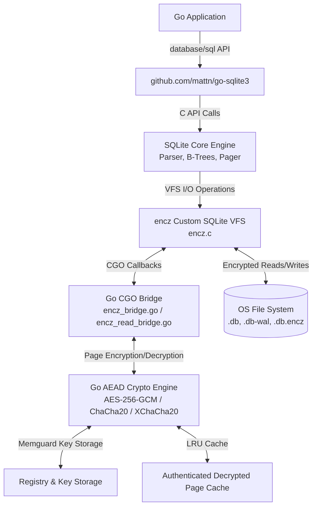

# SQLiteSeal Architecture & Technical Design

This document describes the internal architecture, component design, cryptographic data layouts, VFS integration, and memory management mechanisms of `SQLiteSeal` (`github.com/marcgauthier/SQLiteSeal`).

---

## 1. System Overview & Layering

`SQLiteSeal` provides transparent, authenticated page-level encryption for file-backed SQLite databases. It operates as a layer between the standard SQLite engine and the underlying operating system file system by registering a custom SQLite VFS extension named `encz`.



### Key Components:
- **Application Interface (`open.go`, `dsn.go`)**: Wraps `*sql.DB` into `*sqliteseal.DB`, managing connection lifecycles, master keys, and option parameters.
- **Custom SQLite VFS (`encz.c`)**: Intercepts all read (`xRead`) and write (`xWrite`) page I/O calls executed by SQLite's pager.
- **CGO Bridge (`encz_bridge.go`, `encz_read_bridge.go`)**: Dispatches page transformation requests from C VFS functions to Go AEAD cryptographic handlers.
- **Key Registry (`registry.go`, `encz_keys.go`)**: Manages active master keys, Data Encryption Keys (DEKs), and database metadata using `memguard` protected memory.
- **Sidecar Manifest (`manifest.go`, `manifest_lock.go`)**: Manages the envelope-encrypted `*.encz` sidecar file containing database metadata, UUID, DEK history, and cipher choice.
- **Decrypted-Page Cache (`page_cache.go`)**: Provides an in-memory, authenticated LRU cache for decrypted pages to optimize read throughput.

---

## 2. SQLite Page Format & Reserved Bytes

SQLite databases managed by `SQLiteSeal` reserve **48 bytes** at the end of every page (`pageSize` bytes total) for cryptographic metadata.

```
+-------------------------------------------------------+-------------------+
|               Plaintext Page Payload                  |  Reserved Bytes   |
|            (pageSize - 48 bytes)                      |    (48 bytes)     |
+-------------------------------------------------------+-------------------+
0                                                pageSize - 48           pageSize
```

### 48-Byte Trailer Byte Layout

```
+----------------+----------------+-------------------------------+-------------------+
|  Flags (4B)    |  Key ID (4B)   |        Nonce Slot (24B)       |  Auth Tag (16B)   |
+----------------+----------------+-------------------------------+-------------------+
0                4                8                              32                  48
```

| Offset | Length | Field | Description |
| :--- | :--- | :--- | :--- |
| `0..3` | 4 bytes | `Flags` | 32-bit big-endian integer holding page flags (e.g. WAL flag, compression flags). |
| `4..7` | 4 bytes | `Key ID` | 32-bit big-endian DEK (Data Encryption Key) identifier used to encrypt this page. |
| `8..31` | 24 bytes | `Nonce` | Nonce storage slot.<br>- **AES-256-GCM** & **ChaCha20-Poly1305**: First 12 bytes used, remaining 12 bytes zeroed.<br>- **XChaCha20-Poly1305**: Full 24 bytes used. |
| `32..47` | 16 bytes | `Auth Tag` | 128-bit AEAD authentication tag verifying the ciphertext payload and AAD. |

---

## 3. Additional Authenticated Data (AAD) Construction

To prevent page-swapping attacks (e.g., copying a valid encrypted page from page 5 to page 10, or copying pages between different database files), `SQLiteSeal` binds every AEAD authentication tag to Additional Authenticated Data (AAD).

### AAD Binary Layout (32 Bytes Total)

```
+----------------------+---------------+-----------------+--------------+-------------+---------------+
| Database UUID (16B)  | Page Num (4B) | File Offset (8B)| Context (1B) | Cipher (1B) | Reserved (2B) |
+----------------------+---------------+-----------------+--------------+-------------+---------------+
0                      16              20                28             29            30              32
```

| Offset | Field | Type | Description |
| :--- | :--- | :--- | :--- |
| `0..15` | `Database UUID` | 16 bytes | Unique 128-bit random identifier generated per database manifest. |
| `16..19` | `Page Number` | 4 bytes | Big-endian 32-bit uint representing the SQLite page number (1-indexed). |
| `20..27` | `File Offset` | 8 bytes | Big-endian 64-bit uint representing the byte offset of the page in the file. |
| `28` | `Context` | 1 byte | `0x01` for main database (`.db`) file; `0x02` for Write-Ahead Log (`.db-wal`). |
| `29` | `Cipher ID` | 1 byte | `1` (AES-256-GCM), `2` (ChaCha20-Poly1305), `3` (XChaCha20-Poly1305). |
| `30..31` | `Reserved` | 2 bytes | Padding reserved for future protocol revisions (must be `0x0000`). |

> **Security Effect**: If an attacker alters the page number, modifies the file offset, swaps pages between files, or attempts to substitute WAL pages into the main DB file, the AEAD tag validation fails and the read operation returns an authentication error.

---

## 4. CGO VFS Integration & Interprocess Locking

### `encz.c` VFS Dispatcher

The C component `encz.c` registers a custom `sqlite3_vfs` structure with SQLite. When SQLite performs I/O on an encrypted file, `encz.c` intercepts the call:

1. **`xWrite` Execution Flow**:
   - SQLite passes a page buffer of size `pageSize - 48` bytes.
   - `encz.c` calls Go via CGO callback `go_encz_write_page(handle, pageNum, offset, isWAL, srcBuf, dstBuf)`.
   - Go generates a fresh OS CSPRNG nonce, computes AAD, executes AEAD encryption, appends the 48-byte trailer, and returns the encrypted `pageSize` buffer.
   - `encz.c` writes the `pageSize` encrypted buffer to disk via OS `write()`.

2. **`xRead` Execution Flow**:
   - SQLite requests `pageSize - 48` bytes for a page at `offset`.
   - `encz.c` reads `pageSize` bytes (encrypted page + 48-byte trailer) from disk.
   - `encz.c` calls Go via CGO callback `go_encz_read_page(handle, pageNum, offset, isWAL, srcBuf, dstBuf)`.
   - Go extracts the Key ID, retrieves the corresponding DEK, constructs the AAD, checks the decrypted-page cache, and performs AEAD tag validation and decryption.
   - The decrypted `pageSize - 48` payload is returned to SQLite.

### Manifest Coordination & File Locks (`db.encz.lock`)

To coordinate concurrent database access and key rotation operations across multiple OS processes and threads:
- Every database file `db.db` is paired with a sidecar manifest `db.encz` and a lock file `db.encz.lock`.
- **Unix**: Uses POSIX advisory locking (`flock` / `fcntl`) on `db.encz.lock`.
- **Windows**: Uses `LockFileEx` / `UnlockFileEx` system calls.
- Manifest updates (such as live key rotation via `ReKey` or setting rotation policies) obtain exclusive locks on `db.encz.lock` to prevent concurrent manifest corruption.

---

## 5. Decrypted-Page Cache Architecture

To eliminate AEAD decryption overhead on repeated page reads, `SQLiteSeal` includes an authenticated, thread-safe LRU page cache (`page_cache.go`).

```
+----------------------------------------------------------------------------+
|                       DB Handle Page Cache (LRU)                           |
+----------------------------------------------------------------------------+
| Key: (Path, PageNum, IsWAL, FileOffset)                                    |
| Value: { Payload: *memguard.LockedBuffer, Tag: [16]byte, KeyID: uint32 }   |
+----------------------------------------------------------------------------+
                                   |
         +-------------------------+-------------------------+
         |                                                   |
  Cache Hit Path                                      Cache Miss Path
  1. Fetch entry from LRU                             1. Read raw ciphertext from disk
  2. Compare cached Auth Tag with disk trailer         2. Extract Key ID & Nonce
  3. If match, copy decrypted payload                 3. Validate AAD & decrypt via AEAD
  4. Avoids AEAD cipher operation!                    4. Insert payload into LRU cache
```

### Cache Properties:
- **Memory Security**: Cached decrypted page payloads are stored in memory protected by `github.com/awnumar/memguard` (`*memguard.LockedBuffer`).
- **Tag Validation**: Before returning a cached payload, the cache verifies that the 16-byte authentication tag in the entry matches the on-disk page trailer. If the file on disk was modified externally, the cache entry is invalidated.
- **Wiping on Eviction**: When a page is evicted from the LRU cache or when `DB.Close()` is called, all memory buffers are explicitly zeroed out and destroyed.
- **Configurable Budget**: The cache memory capacity is configured via `Options.DecryptedPageCacheBytes` (default: 128 MB). Passing `-1` completely disables page caching.
